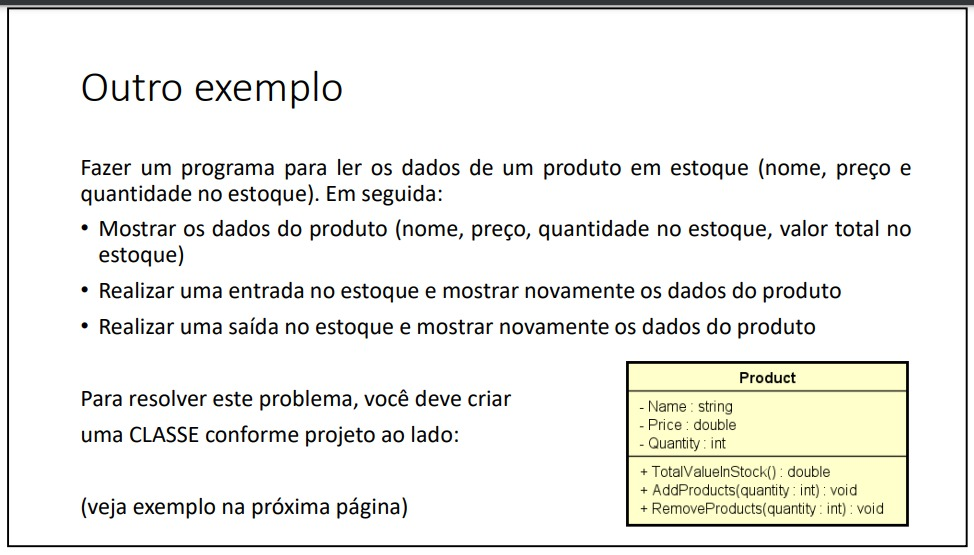
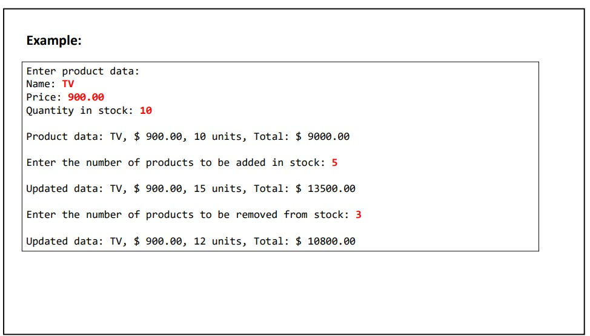
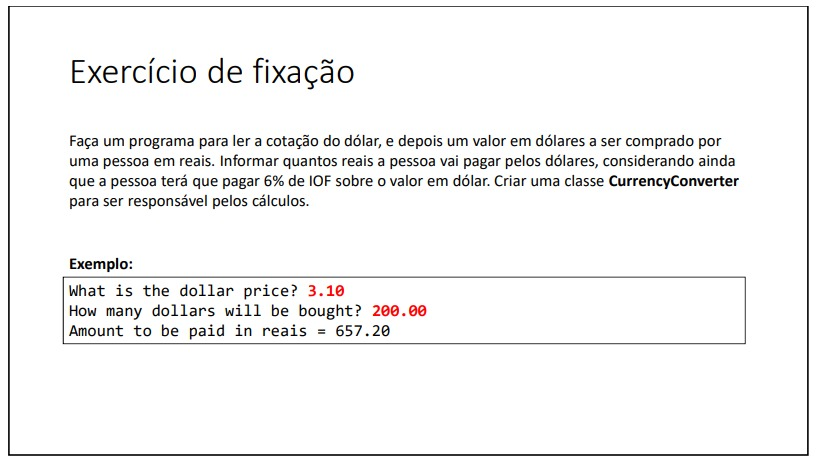
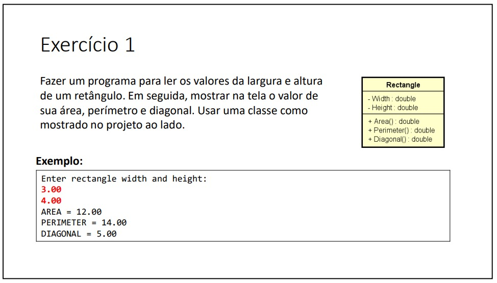
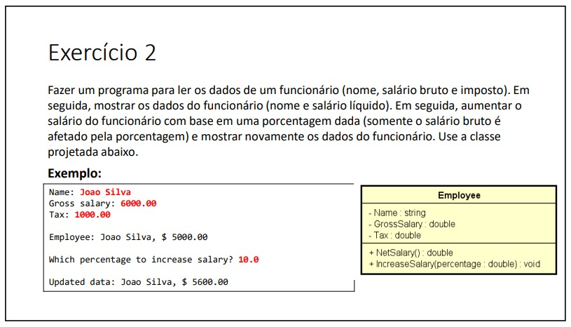

# JavaCodeLab 


Bem-vindo ao meu repositório JavaCodeLab! 

Este repositório contém minha jornada na linguagem Java. Aqui, você encontrará uma coleção de listas de exercícios que realizei cuidadosamente enquanto estudava o vasto universo do Java. Comecei este repositório em meu 4º semestre da faculdade de Engenharia de Software, enquanto realizava o curso "Java COMPLETO" do Professor Nélio Alves

Espero que esses exercícios possam guiar você em uma jornada de aprendizado, crescimento e transformação assim como me guiaram. 

## Tópicos disponíveis

- [Conceitos Iniciais de POO](#conceitos-iniciais-de-poo)

## Conceitos Iniciais de POO

A lista "Conceitos Iniciais de POO" contém exercícios relacionados aos conceitos fundamentais de Programação Orientada a Objetos. Esses exercícios visaram fortalecer o entendimento dos princípios iniciais de POO, como classes, atributos, membros estáticos e a classe Object.

### Conceitos aplicados nesta lista são:

#### Classes e Objetos
Os programa utilizam duas classes principais - a classe Main e uma classe Entidade que muda conforma o programa. A classe "Main" é geralmente considerada a classe principal de um programa. Ela contém o ponto de entrada para o programa, onde a execução começa e é responsável por coordenar a lógica geral do programa. A classe "Entidade" é um conceito genérico que representa uma abstração de algo que possui características e comportamentos específicos. Ela serve como um modelo ou molde para criar objetos individuais desse tipo. Cada objeto da classe "Entidade" terá seus próprios valores para as variáveis e terá acesso aos métodos definidos na classe.

#### Encapsulamento
Os atributos das classes são declarados como públicos, permitindo acesso direto a eles. Embora isso seja utilizado para fins de simplicidade neste exemplo, lembre-se que em cenários mais complexos, é recomendado o uso de modificadores de acesso adequados e métodos getters e setters para controlar o acesso aos atributos.

#### Métodos
Os métodos são blocos de código que definem comportamentos ou ações específicas para uma classe ou objeto. Eles permitem que os objetos executem tarefas, interajam com outros objetos e forneçam informações úteis para o programa.

#### Entrada e Saída de Dados com a Classe Scanner
A classe Scanner em Java fornece métodos para ler dados de diferentes tipos a partir de fontes de entrada, como o teclado. Ela simplifica a obtenção de dados do usuário e sua manipulação dentro do programa.
Para usar a classe Scanner, é necessário criar uma instância dela, fornecendo a origem dos dados como argumento do construtor. Por exemplo, para ler dados do teclado, podemos criar um objeto Scanner da seguinte forma:

```java
Scanner scanner = new Scanner(System.in);
```
#### Formatação com o método toString
O método toString() é um método especial em Java que retorna uma representação em formato de string do objeto atual. Esse método é herdado da classe Object e pode ser substituído em classes personalizadas para fornecer uma representação mais adequada do objeto.

Por exemplo, suponha que você tenha uma classe chamada Person com atributos como nome, idade e profissão. Ao substituir o método toString() nessa classe, você pode retornar uma string que inclua esses detalhes formatados de maneira adequada. Por exemplo:
```java
public class Person {
    private String name;
    private int age;
    private String profession;

    // Construtor, getters e setters

    @Override
    public String toString() {
        return "Name: " + name + ", Age: " + age + ", Profession: " + profession;
    }
}
```
Com essa implementação do método toString(), ao imprimir um objeto Person, por exemplo, usando System.out.println(person), a saída será uma string formatada com o nome, idade e profissão do objeto:

```yaml
Name: Isabela Mendes, Age: 22, Profession: Software Engineer
```
#### Membros estáticos
Os membros estáticos em Java são membros de uma classe que pertencem à classe em si, e não a instâncias individuais dessa classe. Esses membros são compartilhados por todas as instâncias da classe e podem ser acessados diretamente usando o nome da classe, sem a necessidade de criar um objeto da classe. Por exemplo:
```java
public class MathUtils {
    public static int add(int a, int b) {
        return a + b;
    }
}
```
Nesse exemplo, o método add() é um método estático que recebe dois números inteiros como parâmetros e retorna sua soma. Ele pode ser chamado diretamente usando MathUtils.add(2, 3) sem a necessidade de criar um objeto da classe MathUtils.


## 1. [📦 Gerenciamento de Produto no Estoque](conceitos_iniciais_poo/controle_de_estoque)
<table>  
  <tr>
    <td width="50%">
      
    </td>
    <td width="50%">
      
    </td>
  </tr>
</table>


Um exemplo básico de **gerenciamento de produto em um estoque**. Ele permite ao usuário informar os dados de um produto, como nome, preço e quantidade em estoque, e realizar operações de adição e remoção de produtos do estoque.


### 2. [Calculadora Dólar -> Real](conceitos_iniciais_poo/dollar_calculator)
<table>
  <tr>
    <td width="50%">
      
    </td>
    <td width="50%">&nbsp;</td>
  </tr>
</table>

Esse programa é um conversor de moeda simples. Ele solicita ao usuário o preço do dólar e a quantidade de dólares que serão comprados. Em seguida, ele utiliza uma classe auxiliar chamada CurrencyConverter para calcular o valor total em reais a ser pago, levando em consideração a taxa de IOF (Imposto sobre Operações Financeiras) de 6%.

Note que a classe CurrencyConverter contém um atributo estático IOF que armazena a taxa de imposto. O método amountCalculator() realiza o cálculo do valor em reais, multiplicando o preço do dólar pela quantidade desejada e adicionando o valor do imposto.

### 3. [Propriedades de um retângulo](conceitos_iniciais_poo/retangulox)
<table>
  <tr>
    <td width="50%">
      
    </td>
    <td width="50%">&nbsp;</td>
  </tr>
</table>

Esse programa calcula e exibe informações sobre um retângulo com base nas dimensões fornecidas pelo usuário.

O programa solicita ao usuário a largura e a altura do retângulo. Em seguida, utiliza a classe Rectangle para realizar os cálculos da área, perímetro e diagonal do retângulo com base nas dimensões informadas.

### 4. [Salário líquido de um funcionário](conceitos_iniciais_poo/employee)
<table>
  <tr>
    <td width="50%">
      
    </td>
    <td width="50%">&nbsp;</td>
  </tr>
</table>

Este programa permite ao usuário inserir os dados de um funcionário, como nome, salário bruto e taxa de imposto. Em seguida, utiliza a classe Employee para calcular o salário líquido do funcionário (após a dedução do imposto) e exibir os dados na tela.

O programa também solicita ao usuário um percentual de aumento salarial desejado. Em seguida, utiliza o método increaseSalary() da classe Employee para calcular e aplicar o aumento salarial com base no percentual informado.


### 5. [Aluno aprovado ou reprovado?](conceitos_iniciais_poo/student)
<table>
  <tr>
    <td width="50%">
      
    </td>
    <td width="50%">&nbsp;</td>
  </tr>
</table>

Este programa permite ao usuário inserir os dados de um estudante, como nome e notas em três disciplinas diferentes. Em seguida, utiliza a classe Student para calcular a nota final do estudante e exibir se ele foi aprovado ou reprovado.

## Contribuição

Sinta-se à vontade para contribuir com este repositório! Se você tiver exercícios adicionais, melhorias ou correções, ficarei em receber suas contribuições. Basta fazer um fork deste repositório, criar uma branch para suas alterações e enviar um pull request.

Espero que você aproveite as listas de exercícios e que elas sejam úteis para aprimorar suas habilidades em Java!

